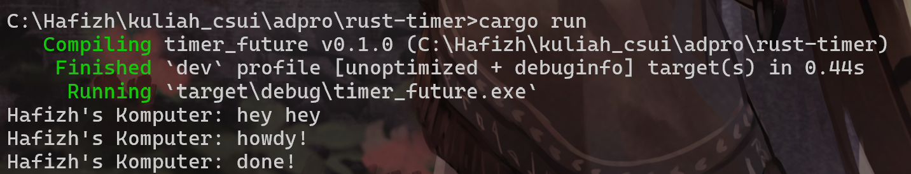
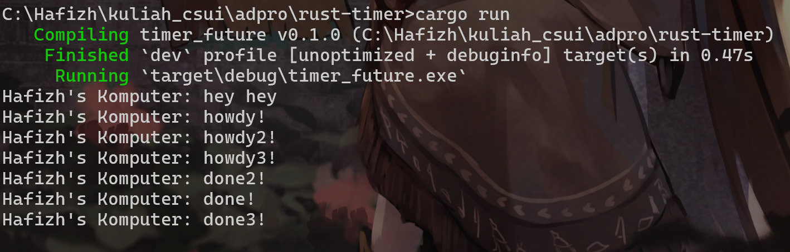

## 1.2. Understanding how it works.

Output tersebut menampilkan urutan eksekusi program asynchronous yang menggunakan executor kustom untuk menjalankan task asynchronous di Rust. Pertama, program mencetak "Hafizh's Komputer: hey hey" secara langsung dari fungsi main, sebelum executor mulai menjalankan task asynchronous. Kemudian, spawner.spawn(...) menambahkan sebuah task asynchronous ke queue, di mana task tersebut mencetak "Hafizh's Komputer: howdy!", menunggu selama 2 detik dengan TimerFuture::new(Duration::new(2, 0)).await, lalu mencetak "Hafizh's Komputer: done!". Executor kemudian memproses task tersebut satu per satu dari queue. Karena TimerFuture belum selesai saat pertama dipoll, task disimpan kembali dan dilanjutkan setelah 2 detik. Inilah sebabnya urutan output adalah: "hey hey" (langsung dieksekusi), lalu "howdy!", dan terakhir "done!" setelah delay.

## Multiple Spawn and removing drop

Output tersebut muncul karena tiga task asynchronous dijalankan hampir bersamaan menggunakan executor dan spawner buatan sendiri di Rust. Ketiga task mencetak pesan "howdy!", "howdy2!", dan "howdy3!", lalu masing-masing menunggu selama 2 detik menggunakan TimerFuture::new(...).await, dan akhirnya mencetak "done!", "done2!", dan "done3!". Karena executor menjalankan task-task tersebut secara non-blocking dan concurrency-nya tidak dibatasi, semua task langsung dijalankan hingga titik await, menyebabkan ketiga pesan "howdy" muncul hampir bersamaan. Setelah 2 detik berlalu, ketiga task dilanjutkan dan mencetak pesan "done" secara berurutan. Pesan "hey hey" muncul paling awal karena berada di luar task asynchronous dan langsung dieksekusi dari fungsi main sebelum executor mulai memproses task.